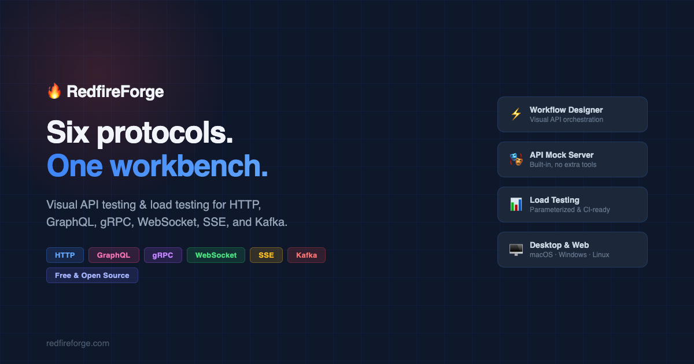

# RedfireForge

[](https://github.com/redfireforge/redfireforge-public/actions/workflows/ci.yml)
[](https://github.com/redfireforge/redfireforge-public/releases/latest)
[](https://www.npmjs.com/package/redfireforge-cli)
[](https://demo.redfireforge.com)
[](LICENSE)
[](docs/guides/cross-platform.md)

> *Fire. Measure. Validate.*

**A visual API testing & load-testing workbench for HTTP, GraphQL, gRPC, WebSocket, SSE, and Kafka — with a drag-and-drop workflow designer, a CLI for CI/CD, and a companion Learning Hub of interactive lessons.**

<p align="center">
  
</p>

---

## ☁️ RedfireForge Cloud — Coming Soon

Hosted load testing, team workspaces, and CI integration — no infra to manage.

[→ Join the waitlist](https://tally.so/r/1AaNzQ?source=readme)

---

## Why RedfireForge?

- 🎯 **One tool, six protocols** — HTTP, GraphQL, gRPC, WebSocket, SSE, and Kafka, all in one workbench instead of five different tools
- 🧩 **Visual workflow designer** — chain requests, extract variables, branch on conditions, and loop — without writing test-runner boilerplate
- 📡 **Requests + API Catalog** — a Postman/Insomnia-style ad-hoc client, plus an OpenAPI/Swagger browser with "Try It" execution, version diffing, and cURL generation
- 🧪 **API Mock Studio** — stand up a local HTTP mock in seconds: rule-based routing, templated responses, a live request journal, and fault/latency injection
- ⚡ **Load testing built in** — configurable concurrency, iterations, and assertions on every protocol, not just HTTP
- 🖥️ **Desktop or browser** — the same engine runs as a native Tauri app or in any modern browser
- 🤖 **CLI for CI/CD** — the exact same execution engine as the GUI, runnable headlessly in GitHub Actions, GitLab CI, Jenkins, or Azure DevOps
- 📖 **Interactive Learning Hub** — an optional desktop build ships 151 guided, hands-on lessons covering every protocol

### A closer look

**Requests** — a Postman/Insomnia-style ad-hoc client with a live JSON response tree:


**API Catalog** — import OpenAPI/Swagger specs, browse endpoints, and execute them directly:


**API Mock Studio** — rule-based routing, templated responses, and a live request journal:


**Workflow Designer** — chain requests visually with fork/join, conditions, and variable extraction:


**Test Runner Results** — assertions, timings, and pass/fail status across every protocol:


**Kafka Studio** — produce/consume messages, inspect topics, and manage clusters:


**GraphQL Studio** — schema explorer, query builder, and variable-aware execution:


**gRPC Studio** — reflection-based service/method discovery with streaming support:


**Gallery** — 158 ready-to-run samples across every protocol, plus 28 guided training paths:


**Learning Hub** — 151 interactive guided lessons across every feature, organized into learning paths:


---

## Prerequisites

| | macOS | Windows | Linux |
|---|---|---|---|
| **Node.js 20+** | [nodejs.org](https://nodejs.org) | [nodejs.org](https://nodejs.org) | [nodejs.org](https://nodejs.org) |
| **Rust** *(desktop only)* | [rustup.rs](https://rustup.rs) | [rustup.rs](https://rustup.rs) | [rustup.rs](https://rustup.rs) |
| **Xcode Command Line Tools** *(macOS only)* | `xcode-select --install` | — | — |
| **Visual Studio Build Tools** *(Windows only)* | — | [vs build tools](https://aka.ms/vs/17/release/vs_BuildTools.exe) (C++ workload) | — |

> **Note:** Xcode CLT (macOS) and VS Build Tools (Windows) are required for compiling native Node modules (`better-sqlite3`) and for Rust. If you already have Rust installed, you likely have these already.
>
> **Browser / web mode only?** You only need Node.js 20+ — no Rust required.

---

## Quick Start

### Download a pre-built installer

Head to **[redfireforge.com/download](https://redfireforge.com/download)** or the **[Latest Release](https://github.com/redfireforge/redfireforge-public/releases/latest)** for `.dmg` (macOS), `.msi`/`.exe` (Windows), and `.deb`/`.AppImage` (Linux) — no build toolchain required.

**macOS — Homebrew (recommended, bypasses Gatekeeper):**

```bash
brew tap redfireforge/tap
brew install --cask redfireforge
```

**macOS — direct download (first-launch security prompt):**
If you installed the `.dmg` manually, Gatekeeper will block the app on first launch. Run once in Terminal:

```bash
xattr -cr /Applications/RedfireForge.app
```

Then open the app normally. This is a one-time step.

**Windows — SmartScreen warning:**
Windows may show "Windows protected your PC" on first run. This is expected for open-source apps without a paid certificate.
1. Click **More info**
2. Click **Run anyway**

**Linux:** No security prompts — install the `.deb` with `sudo dpkg -i` or run the `.AppImage` directly after `chmod +x`.

### Build from source (desktop)

```bash
git clone https://github.com/redfireforge/redfireforge-public.git
cd redfireforge-public
npm install
npm run tauri:dev     # native desktop window with hot-reload
```

To build a distributable installer:

```bash
npm run tauri:build   # .dmg (macOS) / .msi+.exe (Windows) / .deb+.AppImage (Linux)
```

See the [Cross-Platform Guide](docs/guides/cross-platform.md) for code-signing notes and multi-platform CI builds.

### Learning Hub variant (interactive lessons)

RedfireForge ships two desktop variants side-by-side (different bundle IDs so both can be installed at once):

| Variant | Command | Bundle ID | Learning Hub |
|---------|---------|-----------|:---:|
| **Standard** (performance workbench) | `npm run tauri:build:prod` | `com.redfireforge.desktop` | Off |
| **Learning Hub** (interactive lessons) | `npm run tauri:build:demo` | `com.redfireforge.desktop.demo` | On |

```bash
npm run tauri:dev:demo   # desktop, hot-reload, Learning Hub enabled
npm run dev:demo         # browser, hot-reload, Learning Hub enabled
```

The Learning Hub is a guided lesson library covering every protocol (GraphQL, gRPC, Kafka, WebSocket, and more) with live studio bridges — each lesson walks you through the real UI, not a slideshow. Lessons live in the `@redfireforge/demo-hub` workspace package (`packages/demo-hub/`).

### Browser (web mode)

```bash
git clone https://github.com/redfireforge/redfireforge-public.git
cd redfireforge-public
npm install
npm run dev            # http://localhost:5173, hot-reload
# or, for a production build:
npm run build && npx serve dist/
```

### CLI

Build and run from source:

```bash
git clone https://github.com/redfireforge/redfireforge-public.git
cd redfireforge-public && npm install
npm run build:cli
node dist-cli/redfireforge.mjs run examples/cli-basic-test.yaml
```

Once [published to npm](https://www.npmjs.com/package/redfireforge-cli):

```bash
npm install -g redfireforge-cli
rff run my-tests.yaml
```

```yaml
# a minimal test file — see examples/cli-basic-test.yaml for the full version
name: My API Tests
baseUrl: https://jsonplaceholder.typicode.com
tests:
  - name: List Users
    method: GET
    url: /users
    assertions:
      - type: status
        expected: "200"
```

Full command reference, flags, and CI/CD examples (GitHub Actions, GitLab, Jenkins, Azure DevOps): **[CLI Reference](docs/guides/cli-reference.md)** · **[CI/CD Integration Guide](docs/guides/cli-ci-cd.md)**

---

## Protocol Support

| Protocol | Visual Designer | Load Testing | CLI |
|----------|:---:|:---:|:---:|
| HTTP / REST | ✅ | ✅ | ✅ |
| GraphQL | ✅ | ✅ | ✅ |
| gRPC | ✅ | ✅ | ✅ |
| WebSocket | ✅ | ✅ | ✅ |
| SSE | ✅ | ✅ | ✅ |
| Kafka | ✅ | ✅ | ✅ |

---

## How it compares

> ⚠️ **Re-verify before quoting externally** — competitor feature sets change quickly (Bruno in particular ships gRPC/WebSocket/mock-server support at a fast pace). The cells below were checked against each project's own docs/GitHub as of August 2026; confirm current capabilities before relying on this table in marketing or sales contexts.

| Feature | RedfireForge | k6 | Postman | Bruno | JMeter |
|---------|:-----------:|:--:|:-------:|:-----:|:------:|
| REST | ✅ | ✅ | ✅ | ✅ | ✅ |
| GraphQL | ✅ | ⚠️ partial (over HTTP) | ✅ | ✅ | ✅ (dedicated GraphQL HTTP Request) |
| gRPC | ✅ | ✅ | ✅ | ✅ | ⚠️ plugin |
| WebSocket | ✅ | ✅ | ✅ | ✅ | ⚠️ plugin |
| Kafka | ✅ | ⚠️ xk6 extension | ❌ | ❌ | ⚠️ plugin |
| SSE | ✅ | ❌ | ❌ | ❌ | ❌ |
| API mock server | ✅ | ❌ | ✅ | ✅ | ⚠️ basic mirror only |
| Visual workflow designer | ✅ | ❌ code only | ✅ | ❌ | ❌ |
| Load testing | ✅ | ✅ | ❌ | ❌ | ✅ |
| Desktop app | ✅ | ❌ | ✅ | ✅ | ✅ |
| CLI for CI | ✅ | ✅ | ✅ | ✅ | ✅ |
| Open source | ✅ AGPL | ✅ AGPL | ❌ | ✅ MIT (core) | ✅ Apache |

---

## Documentation

Everything beyond this Quick Start — architecture, UI configuration guide, full feature reference, branching strategy, development workflow, and the data persistence model — lives in **[docs/development.md](docs/development.md)**.

Other guides:
- [Cross-Platform Guide](docs/guides/cross-platform.md) — installation & platform notes
- [CLI Reference](docs/guides/cli-reference.md) · [CLI CI/CD Guide](docs/guides/cli-ci-cd.md)
- [Workflow HAR Import Guide](docs/guides/workflow-har-import-guide.md) — bootstrap a workflow from recorded browser traffic
- [API Mock Import/Export Guide](docs/guides/api-mock/import-export.md)

---

## Contributing

Contributions are welcome! See **[CONTRIBUTING.md](./CONTRIBUTING.md)** for setup, branch naming, and PR guidelines.

## Legal

- [LICENSE](./LICENSE) — AGPL-3.0
- [SECURITY.md](./SECURITY.md) — Vulnerability reporting
- [CONTRIBUTING.md](./CONTRIBUTING.md) — Contribution guide
- [PRIVACY.md](./PRIVACY.md) — Privacy policy
